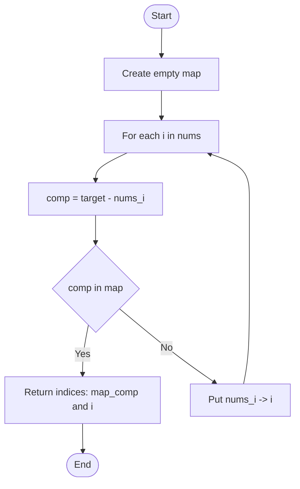
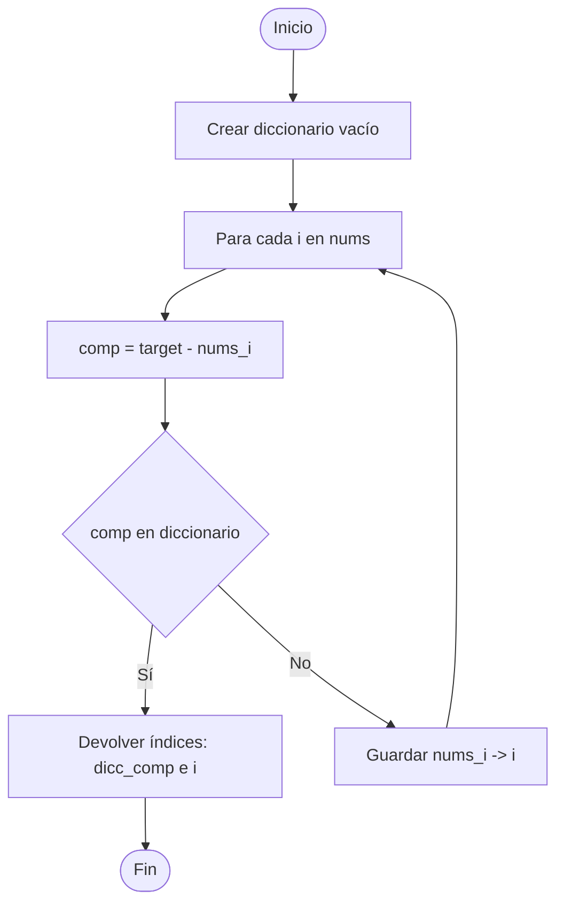

📄 two_sum.md con explicación extendida, diagrama y razonamiento.

# Two Sum - LeetCode Problem 1

## Table of Contents

English version:
- [📋 Problem Description](#-problem-description)
- [🧠 Reasoning and Strategy](#-reasoning-and-strategy)
  - [Naive Approach (Brute Force)](#naive-approach-brute-force)
  - [Optimized Approach (Hash Map)](#optimized-approach-hash-map)
- [📊 Flow Diagram](#-flow-diagram)
- [🔍 Detailed Explanation](#-detailed-explanation)
  - [Step-by-Step of Optimized Algorithm](#step-by-step-of-optimized-algorithm)
  - [Why It Works?](#why-it-works)
- [⚡ Computational Complexity](#-computational-complexity)
- [🧪 Important Test Cases](#-important-test-cases)
- [💡 Optimizations and Variants](#-optimizations-and-variants)
  - [For Sorted Arrays](#for-sorted-arrays)
- [🚀 Final Implementation](#-final-implementation)
- [✅ Conclusion](#-conclusion)

Spanish version:
- [📋 Descripción del Problema](#-descripción-del-problema)
- [🧠 Razonamiento y Estrategia](#-razonamiento-y-estrategia)
  - [Enfoque Ingenuo (Brute Force)](#enfoque-ingenuo-brute-force)
  - [Enfoque Optimizado (Hash Map)](#enfoque-optimizado-hash-map)
- [📊 Diagrama de Flujo](#-diagrama-de-flujo)
- [🔍 Explicación Detallada](#-explicación-detallada)
  - [Paso a Paso del Algoritmo Optimizado](#paso-a-paso-del-algoritmo-optimizado)
  - [¿Por qué funciona?](#por-qué-funciona)
- [⚡ Complejidad Computacional](#-complejidad-computacional)
- [🧪 Casos de Prueba Importantes](#-casos-de-prueba-importantes)
- [💡 Optimizaciones y Variantes](#-optimizaciones-y-variantes)
  - [Para Arrays Ordenados](#para-arrays-ordenados)
- [🚀 Implementación Final](#-implementación-final)
- [✅ Conclusión](#-conclusión)

## 📋 Problem Description
**Link:** https://leetcode.com/problems/two-sum/

Given an array of integers `nums` and an integer `target`, return indices of the two numbers such that they add up to `target`.

**Assumptions:**
- Exactly one solution exists
- Cannot use the same element twice
- Return the answer in any order

**Example:**
```python
Input: nums = [2,7,11,15], target = 9
Output: [0,1]
Explanation: nums[0] + nums[1] = 2 + 7 = 9
```

## 🧠 Reasoning and Strategy

### Naive Approach (Brute Force)
```python
# Complexity: O(n²)
for i in range(len(nums)):
    for j in range(i+1, len(nums)):
        if nums[i] + nums[j] == target:
            return [i, j]
```

**Problem:** Inefficient for large arrays (n > 10,000)

### Optimized Approach (Hash Map)
```python
# Complexity: O(n)
def twoSum(nums, target):
    num_map = {}
    for i, num in enumerate(nums):
        complement = target - num
        if complement in num_map:
            return [num_map[complement], i]
        num_map[num] = i
```

## 📊 Flow Diagram



## 🔍 Detailed Explanation

### Step-by-Step of Optimized Algorithm

**Iteration 0:**
- `num = 2`, `complement = 7`
- `7 not in {}` → Add `{2: 0}`

**Iteration 1:**
- `num = 7`, `complement = 2`
- `2 in {2: 0}` → Found!
- Return `[0, 1]`

### Why It Works?
- **Constant time lookup:** Dictionaries in Python have O(1) average lookup time
- **Avoids duplicates:** Only check already processed elements
- **Handles edge cases:** Negative numbers, zeros, etc.

## ⚡ Computational Complexity

| Method | Time | Space | Advantages | Disadvantages |
|--------|------|-------|------------|---------------|
| Brute Force | O(n²) | O(1) | Simple | Inefficient |
| Hash Map | O(n) | O(n) | Optimal | Extra memory |

## 🧪 Important Test Cases

```python
# Case 1: Normal
nums = [2,7,11,15], target = 9 → [0,1]

# Case 2: Negative numbers
nums = [-1,-2,-3,-4], target = -7 → [2,3]

# Case 3: Zeros
nums = [0,4,3,0], target = 0 → [0,3]

# Case 4: Multiple solutions (returns first)
nums = [1,2,3,4], target = 5 → [0,3] or [1,2]
```

## 💡 Optimizations and Variants

### For Sorted Arrays
If the array were sorted, we could use the **two-pointer technique**:

```python
# Complexity: O(n)
left, right = 0, len(nums)-1
while left < right:
    current_sum = nums[left] + nums[right]
    if current_sum == target:
        return [left, right]
    elif current_sum < target:
        left += 1
    else:
        right -= 1
```

## 🚀 Final Implementation

```python
class Solution:
    def twoSum(self, nums: List[int], target: int) -> List[int]:
        num_map = {}
        for i, num in enumerate(nums):
            complement = target - num
            if complement in num_map:
                return [num_map[complement], i]
            num_map[num] = i
        return []  # Never reached due to constraints
```

## ✅ Conclusion

The **two sum problem** is fundamental for understanding:
- Efficient use of data structures (hash maps)
- Time-space trade-offs
- Array index manipulation

**Key lessons:**
- Hash maps enable constant time lookups
- Sometimes better to sacrifice space for time
- Always consider edge cases during implementation

---

## 📋 Descripción del Problema
**Enlace:** https://leetcode.com/problems/two-sum/

Dado un array de enteros `nums` y un entero `target`, devuelve los índices de los dos números que suman `target`.

**Suposiciones:**
- Existe exactamente una solución
- No se puede usar el mismo elemento dos veces
- Se puede retornar la respuesta en cualquier orden

**Ejemplo:**
```python
Input: nums = [2,7,11,15], target = 9
Output: [0,1]
Explicación: nums[0] + nums[1] = 2 + 7 = 9
```

## 🧠 Razonamiento y Estrategia

### Enfoque Ingenuo (Brute Force)
```python
# Complejidad: O(n²)
for i in range(len(nums)):
    for j in range(i+1, len(nums)):
        if nums[i] + nums[j] == target:
            return [i, j]
```

**Problema:** Ineficiente para arrays grandes (n > 10,000)

### Enfoque Optimizado (Hash Map)
```python
# Complejidad: O(n)
def twoSum(nums, target):
    num_map = {}
    for i, num in enumerate(nums):
        complement = target - num
        if complement in num_map:
            return [num_map[complement], i]
        num_map[num] = i
```

## 📊 Diagrama de Flujo



## 🔍 Explicación Detallada

### Paso a Paso del Algoritmo Optimizado

**Iteración 0:**
- `num = 2`, `complement = 7`
- `7 not in {}` → Agregar `{2: 0}`

**Iteración 1:**
- `num = 7`, `complement = 2`
- `2 in {2: 0}` → ¡Encontrado!
- Retornar `[0, 1]`

### ¿Por qué funciona?
- **Búsqueda en tiempo constante:** Los diccionarios en Python tienen búsqueda O(1) en promedio
- **Evita duplicados:** Solo verificamos elementos ya procesados
- **Maneja casos edge:** Números negativos, zeros, etc.

## ⚡ Complejidad Computacional

| Método | Tiempo | Espacio | Ventajas | Desventajas |
|--------|--------|---------|----------|-------------|
| Brute Force | O(n²) | O(1) | Simple | Ineficiente |
| Hash Map | O(n) | O(n) | Óptimo | Memoria extra |

## 🧪 Casos de Prueba Importantes

```python
# Caso 1: Normal
nums = [2,7,11,15], target = 9 → [0,1]

# Caso 2: Números negativos
nums = [-1,-2,-3,-4], target = -7 → [2,3]

# Caso 3: Ceros
nums = [0,4,3,0], target = 0 → [0,3]

# Caso 4: Múltiples soluciones (retorna primera)
nums = [1,2,3,4], target = 5 → [0,3] o [1,2]
```

## 💡 Optimizaciones y Variantes

### Para Arrays Ordenados
Si el array estuviera ordenado, podríamos usar el **two-pointer technique**:

```python
# Complejidad: O(n)
left, right = 0, len(nums)-1
while left < right:
    current_sum = nums[left] + nums[right]
    if current_sum == target:
        return [left, right]
    elif current_sum < target:
        left += 1
    else:
        right -= 1
```

## 🚀 Implementación Final

```python
class Solution:
    def twoSum(self, nums: List[int], target: int) -> List[int]:
        num_map = {}
        for i, num in enumerate(nums):
            complement = target - num
            if complement in num_map:
                return [num_map[complement], i]
            num_map[num] = i
        return []  # Nunca se ejecuta por los constraints
```

## ✅ Conclusión

El **two sum problem** es fundamental para entender:
- Uso eficiente de estructuras de datos (hash maps)
- Trade-offs entre tiempo y espacio
- Manipulación de índices en arrays

**Lecciones clave:**
- Los hash maps permiten búsquedas en tiempo constante
- A veces es mejor sacrificar espacio por tiempo
- Siempre considerar casos edge durante la implementación

---

