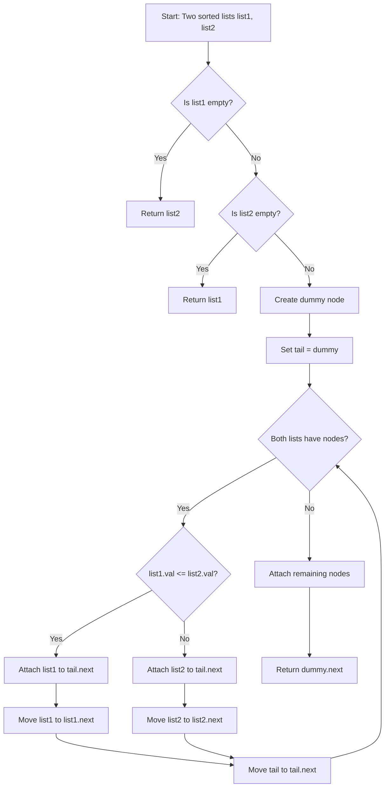
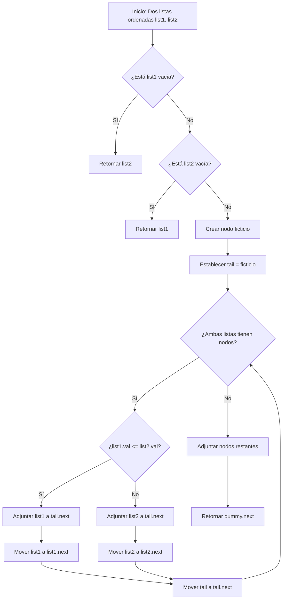

# Merge Two Sorted Lists - LeetCode Problem 21

## Table of Contents

English version:
- [📋 Problem Description](#-problem-description)
- [🧠 Reasoning and Strategy](#-reasoning-and-strategy)
  - [Iterative Approach](#iterative-approach)
  - [Alternative Approaches](#alternative-approaches)
- [📊 Flow Diagram](#-flow-diagram)
- [🔍 Detailed Explanation](#-detailed-explanation)
  - [Step-by-Step of Iterative Algorithm](#step-by-step-of-iterative-algorithm)
  - [Why Dummy Node Works?](#why-dummy-node-works)
- [⚡ Computational Complexity](#-computational-complexity)
- [🧪 Important Test Cases](#-important-test-cases)
- [💡 Optimizations and Variants](#-optimizations-and-variants)
  - [Memory Optimization](#memory-optimization)
  - [Recursive Approach](#recursive-approach)
- [🚀 Final Implementation](#-final-implementation)
- [✅ Conclusion](#-conclusion)

Spanish version:
- [📋 Descripción del Problema](#-descripción-del-problema)
- [🧠 Razonamiento y Estrategia](#-razonamiento-y-estrategia)
  - [Enfoque Iterativo](#enfoque-iterativo)
  - [Enfoques Alternativos](#enfoques-alternativos)
- [📊 Diagrama de Flujo](#-diagrama-de-flujo)
- [🔍 Explicación Detallada](#-explicación-detallada)
  - [Paso a Paso del Algoritmo Iterativo](#paso-a-paso-del-algoritmo-iterativo)
  - [¿Por qué funciona el nodo ficticio?](#por-qué-funciona-el-nodo-ficticio)
- [⚡ Complejidad Computacional](#-complejidad-computacional)
- [🧪 Casos de Prueba Importantes](#-casos-de-prueba-importantes)
- [💡 Optimizaciones y Variantes](#-optimizaciones-y-variantes)
  - [Optimización de Memoria](#optimización-de-memoria)
  - [Enfoque Recursivo](#enfoque-recursivo)
- [🚀 Implementación Final](#-implementación-final)
- [✅ Conclusión](#-conclusión)

---

# ENGLISH VERSION

## 📋 Problem Description
**Link:** https://leetcode.com/problems/merge-two-sorted-lists/

You are given the heads of two sorted linked lists `list1` and `list2`. Merge the two lists into one sorted list and return the head of the merged linked list.

**Example 1:**
```
Input: list1 = [1,2,4], list2 = [1,3,4]
Output: [1,1,2,3,4,4]
```

**Example 2:**
```
Input: list1 = [], list2 = []
Output: []
```

**Example 3:**
```
Input: list1 = [], list2 = [0]
Output: [0]
```

**Constraints:**
- The number of nodes in both lists is in the range `[0, 50]`.
- `-100 <= Node.val <= 100`
- Both `list1` and `list2` are sorted in non-decreasing order.

## 🧠 Reasoning and Strategy

### Iterative Approach
**Most Efficient and Recommended Method**
```python
def mergeTwoLists(list1, list2):
    # Create a dummy node to simplify edge cases
    dummy = ListNode()
    tail = dummy
    
    while list1 and list2:
        if list1.val <= list2.val:
            tail.next = list1
            list1 = list1.next
        else:
            tail.next = list2
            list2 = list2.next
        tail = tail.next
    
    # Attach remaining nodes
    tail.next = list1 if list1 else list2
    
    return dummy.next
```

**Advantages:**
- Handles all edge cases (empty lists, single nodes)
- In-place merging without creating new nodes
- Clear and intuitive logic
- Optimal time and space complexity

### Alternative Approaches

**1. Recursive Approach (Elegant but uses extra space)**
```python
def mergeTwoLists(list1, list2):
    if not list1:
        return list2
    if not list2:
        return list1
        
    if list1.val <= list2.val:
        list1.next = mergeTwoLists(list1.next, list2)
        return list1
    else:
        list2.next = mergeTwoLists(list1, list2.next)
        return list2
```

**2. In-Place Without Dummy (More complex edge case handling)**
```python
def mergeTwoLists(list1, list2):
    if not list1:
        return list2
    if not list2:
        return list1
        
    # Determine head
    if list1.val <= list2.val:
        head = list1
        list1 = list1.next
    else:
        head = list2
        list2 = list2.next
        
    current = head
    # Merge the rest
    while list1 and list2:
        if list1.val <= list2.val:
            current.next = list1
            list1 = list1.next
        else:
            current.next = list2
            list2 = list2.next
        current = current.next
        
    current.next = list1 if list1 else list2
    return head
```

## 📊 Flow Diagram



## 🔍 Detailed Explanation

### Step-by-Step of Iterative Algorithm

For input `list1 = [1,2,4]`, `list2 = [1,3,4]`:

1. **Initialize**: `dummy = ListNode(0)`, `tail = dummy`
2. **Compare 1 vs 1**: `list1.val == list2.val` → attach `list1` → `tail.next = list1`, `list1 = list1.next` → `tail = tail.next`
3. **Compare 2 vs 1**: `list1.val > list2.val` → attach `list2` → `tail.next = list2`, `list2 = list2.next` → `tail = tail.next`
4. **Compare 2 vs 3**: `list1.val < list2.val` → attach `list1` → `tail.next = list1`, `list1 = list1.next` → `tail = tail.next`
5. **Compare 4 vs 3**: `list1.val > list2.val` → attach `list2` → `tail.next = list2`, `list2 = list2.next` → `tail = tail.next`
6. **Compare 4 vs 4**: `list1.val == list2.val` → attach `list1` → `tail.next = list1`, `list1 = list1.next` → `tail = tail.next`
7. **Attach remainder**: `list1` is None, `list2` has `[4]` → `tail.next = list2`
8. **Return**: `dummy.next` points to the merged list `[1,1,2,3,4,4]`

### Why Dummy Node Works?
- **Simplifies edge cases**: No need to handle empty lists separately
- **Provides starting point**: Always have a node to attach to
- **Clean return**: `dummy.next` always points to the actual head of merged list
- **No special handling**: Works uniformly for all cases

## ⚡ Computational Complexity

| Approach | Time Complexity | Space Complexity | Best Case | Worst Case |
|----------|----------------|------------------|-----------|------------|
| **Iterative** | O(n + m) | O(1) | Already merged | Alternating values |
| **Recursive** | O(n + m) | O(n + m) | Short lists | Long lists (stack overflow risk) |
| **In-Place No Dummy** | O(n + m) | O(1) | - | - |

Where `n` and `m` are the lengths of the two input lists.

## 🧪 Important Test Cases

```python
# Standard cases
[1,2,4] + [1,3,4] → [1,1,2,3,4,4]
[1,3,5] + [2,4,6] → [1,2,3,4,5,6]

# Edge cases
[] + [] → []
[] + [0] → [0]
[0] + [] → [0]

# Single element cases
[1] + [2] → [1,2]
[2] + [1] → [1,2]

# Different length cases
[1,2,3] + [4,5] → [1,2,3,4,5]
[4,5] + [1,2,3] → [1,2,3,4,5]

# Duplicate values
[1,1,1] + [1,1,1] → [1,1,1,1,1,1]
```

## 💡 Optimizations and Variants

### Memory Optimization
```python
def mergeTwoLists(list1, list2):
    # Early termination for empty lists
    if not list1:
        return list2
    if not list2:
        return list1
        
    # Use existing nodes without creating dummy
    if list1.val <= list2.val:
        head = list1
        list1 = list1.next
    else:
        head = list2
        list2 = list2.next
        
    current = head
    while list1 and list2:
        if list1.val <= list2.val:
            current.next = list1
            list1 = list1.next
        else:
            current.next = list2
            list2 = list2.next
        current = current.next
        
    current.next = list1 if list1 else list2
    return head
```

### Recursive Approach
```python
def mergeTwoLists(list1, list2):
    # Base cases
    if not list1:
        return list2
    if not list2:
        return list1
        
    # Recursive cases
    if list1.val <= list2.val:
        list1.next = mergeTwoLists(list1.next, list2)
        return list1
    else:
        list2.next = mergeTwoLists(list1, list2.next)
        return list2
```

## 🚀 Final Implementation

```python
# Definition for singly-linked list.
# class ListNode:
#     def __init__(self, val=0, next=None):
#         self.val = val
#         self.next = next
class Solution:
    def mergeTwoLists(self, list1: Optional[ListNode], list2: Optional[ListNode]) -> Optional[ListNode]:
        """
        Optimal iterative solution with dummy node
        Time: O(n + m), Space: O(1)
        """
        # Create a dummy node to simplify edge cases
        dummy = ListNode()
        tail = dummy
        
        # Merge while both lists have nodes
        while list1 and list2:
            if list1.val <= list2.val:
                tail.next = list1
                list1 = list1.next
            else:
                tail.next = list2
                list2 = list2.next
            tail = tail.next
        
        # Attach remaining nodes from whichever list is not exhausted
        tail.next = list1 if list1 else list2
        
        return dummy.next
```

## ✅ Conclusion

The **Merge Two Sorted Lists problem** is excellent for understanding:
- Linked list manipulation and traversal
- Merge algorithm fundamentals
- Handling edge cases with dummy nodes
- Space-efficient in-place operations

**Key lessons:**
- **Dummy node technique** simplifies edge case handling
- **In-place merging** is optimal for space complexity
- **Recursive approach** is elegant but has stack space overhead
- The problem demonstrates the importance of **choosing the right pointer strategy**

**Recommended approach:** Iterative solution with dummy node for its optimal time and space complexity, clarity, and robustness.

---

# VERSION EN ESPAÑOL

## 📋 Descripción del Problema
**Enlace:** https://leetcode.com/problems/merge-two-sorted-lists/

Se te dan las cabezas de dos listas enlazadas ordenadas `list1` y `list2`. Combina las dos listas en una lista ordenada y devuelve la cabeza de la lista enlazada combinada.

**Ejemplo 1:**
```
Input: list1 = [1,2,4], list2 = [1,3,4]
Output: [1,1,2,3,4,4]
```

**Ejemplo 2:**
```
Input: list1 = [], list2 = []
Output: []
```

**Ejemplo 3:**
```
Input: list1 = [], list2 = [0]
Output: [0]
```

**Restricciones:**
- El número de nodos en ambas listas está en el rango `[0, 50]`.
- `-100 <= Node.val <= 100`
- Tanto `list1` como `list2` están ordenadas en orden no decreciente.

## 🧠 Razonamiento y Estrategia

### Enfoque Iterativo
**Método más eficiente y recomendado**
```python
def mergeTwoLists(list1, list2):
    # Crear un nodo ficticio para simplificar casos extremos
    dummy = ListNode()
    tail = dummy
    
    while list1 and list2:
        if list1.val <= list2.val:
            tail.next = list1
            list1 = list1.next
        else:
            tail.next = list2
            list2 = list2.next
        tail = tail.next
    
    # Adjuntar nodos restantes
    tail.next = list1 if list1 else list2
    
    return dummy.next
```

**Ventajas:**
- Maneja todos los casos extremos (listas vacías, nodos únicos)
- Combinación in-place sin crear nuevos nodos
- Lógica clara e intuitiva
- Complejidad de tiempo y espacio óptima

### Enfoques Alternativos

**1. Enfoque Recursivo (Elegante pero usa espacio extra)**
```python
def mergeTwoLists(list1, list2):
    if not list1:
        return list2
    if not list2:
        return list1
        
    if list1.val <= list2.val:
        list1.next = mergeTwoLists(list1.next, list2)
        return list1
    else:
        list2.next = mergeTwoLists(list1, list2.next)
        return list2
```

**2. In-Place Sin Nodo Ficticio (Manejo de casos extremos más complejo)**
```python
def mergeTwoLists(list1, list2):
    if not list1:
        return list2
    if not list2:
        return list1
        
    # Determinar cabeza
    if list1.val <= list2.val:
        head = list1
        list1 = list1.next
    else:
        head = list2
        list2 = list2.next
        
    current = head
    # Combinar el resto
    while list1 and list2:
        if list1.val <= list2.val:
            current.next = list1
            list1 = list1.next
        else:
            current.next = list2
            list2 = list2.next
        current = current.next
        
    current.next = list1 if list1 else list2
    return head
```

## 📊 Diagrama de Flujo



## 🔍 Explicación Detallada

### Paso a Paso del Algoritmo Iterativo

Para entrada `list1 = [1,2,4]`, `list2 = [1,3,4]`:

1. **Inicializar**: `dummy = ListNode(0)`, `tail = dummy`
2. **Comparar 1 vs 1**: `list1.val == list2.val` → adjuntar `list1` → `tail.next = list1`, `list1 = list1.next` → `tail = tail.next`
3. **Comparar 2 vs 1**: `list1.val > list2.val` → adjuntar `list2` → `tail.next = list2`, `list2 = list2.next` → `tail = tail.next`
4. **Comparar 2 vs 3**: `list1.val < list2.val` → adjuntar `list1` → `tail.next = list1`, `list1 = list1.next` → `tail = tail.next`
5. **Comparar 4 vs 3**: `list1.val > list2.val` → adjuntar `list2` → `tail.next = list2`, `list2 = list2.next` → `tail = tail.next`
6. **Comparar 4 vs 4**: `list1.val == list2.val` → adjuntar `list1` → `tail.next = list1`, `list1 = list1.next` → `tail = tail.next`
7. **Adjuntar resto**: `list1` es None, `list2` tiene `[4]` → `tail.next = list2`
8. **Retornar**: `dummy.next` apunta a la lista combinada `[1,1,2,3,4,4]`

### ¿Por qué funciona el nodo ficticio?
- **Simplifica casos extremos**: No necesita manejar listas vacías por separado
- **Proporciona punto de inicio**: Siempre tiene un nodo al que adjuntar
- **Retorno limpio**: `dummy.next` siempre apunta a la cabeza real de la lista combinada
- **Sin manejo especial**: Funciona uniformemente para todos los casos

## ⚡ Complejidad Computacional

| Enfoque | Complejidad Temporal | Complejidad Espacial | Mejor Caso | Peor Caso |
|---------|---------------------|----------------------|------------|-----------|
| **Iterativo** | O(n + m) | O(1) | Ya combinadas | Valores alternantes |
| **Recursivo** | O(n + m) | O(n + m) | Listas cortas | Listas largas (riesgo de desbordamiento de pila) |
| **In-Place Sin Ficticio** | O(n + m) | O(1) | - | - |

Donde `n` y `m` son las longitudes de las dos listas de entrada.

## 🧪 Casos de Prueba Importantes

```python
# Casos estándar
[1,2,4] + [1,3,4] → [1,1,2,3,4,4]
[1,3,5] + [2,4,6] → [1,2,3,4,5,6]

# Casos extremos
[] + [] → []
[] + [0] → [0]
[0] + [] → [0]

# Casos de un solo elemento
[1] + [2] → [1,2]
[2] + [1] → [1,2]

# Casos de diferente longitud
[1,2,3] + [4,5] → [1,2,3,4,5]
[4,5] + [1,2,3] → [1,2,3,4,5]

# Valores duplicados
[1,1,1] + [1,1,1] → [1,1,1,1,1,1]
```

## 💡 Optimizaciones y Variantes

### Optimización de Memoria
```python
def mergeTwoLists(list1, list2):
    # Terminación temprana para listas vacías
    if not list1:
        return list2
    if not list2:
        return list1
        
    # Usar nodos existentes sin crear ficticio
    if list1.val <= list2.val:
        head = list1
        list1 = list1.next
    else:
        head = list2
        list2 = list2.next
        
    current = head
    while list1 and list2:
        if list1.val <= list2.val:
            current.next = list1
            list1 = list1.next
        else:
            current.next = list2
            list2 = list2.next
        current = current.next
        
    current.next = list1 if list1 else list2
    return head
```

### Enfoque Recursivo
```python
def mergeTwoLists(list1, list2):
    # Casos base
    if not list1:
        return list2
    if not list2:
        return list1
        
    # Casos recursivos
    if list1.val <= list2.val:
        list1.next = mergeTwoLists(list1.next, list2)
        return list1
    else:
        list2.next = mergeTwoLists(list1, list2.next)
        return list2
```

## 🚀 Implementación Final

```python
# Definition for singly-linked list.
# class ListNode:
#     def __init__(self, val=0, next=None):
#         self.val = val
#         self.next = next
class Solution:
    def mergeTwoLists(self, list1: Optional[ListNode], list2: Optional[ListNode]) -> Optional[ListNode]:
        """
        Solución iterativa óptima con nodo ficticio
        Tiempo: O(n + m), Espacio: O(1)
        """
        # Crear un nodo ficticio para simplificar casos extremos
        dummy = ListNode()
        tail = dummy
        
        # Combinar mientras ambas listas tengan nodos
        while list1 and list2:
            if list1.val <= list2.val:
                tail.next = list1
                list1 = list1.next
            else:
                tail.next = list2
                list2 = list2.next
            tail = tail.next
        
        # Adjuntar nodos restantes de la lista que no esté exhausta
        tail.next = list1 if list1 else list2
        
        return dummy.next
```

## ✅ Conclusión

El **problema de Merge Two Sorted Lists** es excelente para entender:
- Manipulación y recorrido de listas enlazadas
- Fundamentos de algoritmos de combinación
- Manejo de casos extremos con nodos ficticios
- Operaciones in-place eficientes en espacio

**Lecciones clave:**
- **La técnica del nodo ficticio** simplifica el manejo de casos extremos
- **La combinación in-place** es óptima para complejidad espacial
- **El enfoque recursivo** es elegante pero tiene sobrecarga de espacio de pila
- El problema demuestra la importancia de **elegir la estrategia de punteros correcta**

**Enfoque recomendado:** Solución iterativa con nodo ficticio por su complejidad de tiempo y espacio óptima, claridad y robustez.