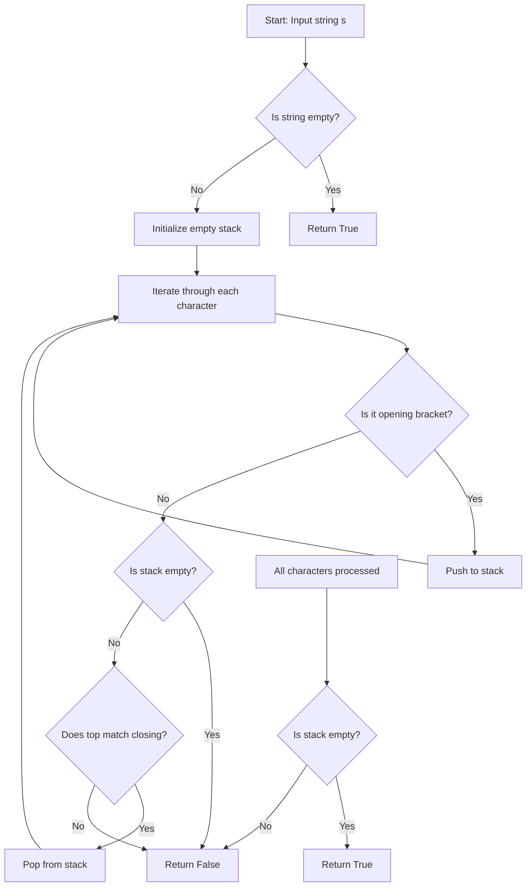
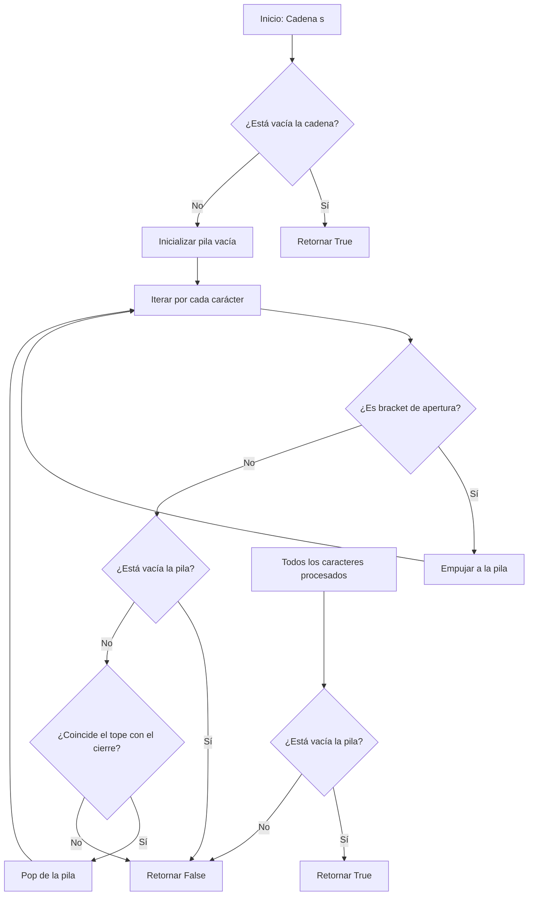

# Valid Parentheses - LeetCode Problem 20

## Table of Contents

English version:
- [📋 Problem Description](#-problem-description)
- [🧠 Reasoning and Strategy](#-reasoning-and-strategy)
  - [Stack-Based Approach](#stack-based-approach)
  - [Alternative Approaches](#alternative-approaches)
- [📊 Flow Diagram](#-flow-diagram)
- [🔍 Detailed Explanation](#-detailed-explanation)
  - [Step-by-Step of Stack Algorithm](#step-by-step-of-stack-algorithm)
  - [Why Stack Works?](#why-stack-works)
- [⚡ Computational Complexity](#-computational-complexity)
- [🧪 Important Test Cases](#-important-test-cases)
- [💡 Optimizations and Variants](#-optimizations-and-variants)
  - [Early Termination Optimization](#early-termination-optimization)
  - [Memory Optimization](#memory-optimization)
- [🚀 Final Implementation](#-final-implementation)
- [✅ Conclusion](#-conclusion)

Spanish version:
- [📋 Descripción del Problema](#-descripción-del-problema)
- [🧠 Razonamiento y Estrategia](#-razonamiento-y-estrategia)
  - [Enfoque Basado en Pila](#enfoque-basado-en-pila)
  - [Enfoques Alternativos](#enfoques-alternativos)
- [📊 Diagrama de Flujo](#-diagrama-de-flujo)
- [🔍 Explicación Detallada](#-explicación-detallada)
  - [Paso a Paso del Algoritmo de Pila](#paso-a-paso-del-algoritmo-de-pila)
  - [¿Por qué funciona la Pila?](#por-qué-funciona-la-pila)
- [⚡ Complejidad Computacional](#-complejidad-computacional)
- [🧪 Casos de Prueba Importantes](#-casos-de-prueba-importantes)
- [💡 Optimizaciones y Variantes](#-optimizaciones-y-variantes)
  - [Optimización de Terminación Temprana](#optimización-de-terminación-temprana)
  - [Optimización de Memoria](#optimización-de-memoria)
- [🚀 Implementación Final](#-implementación-final)
- [✅ Conclusión](#-conclusión)

## 📋 Problem Description
**Link:** https://leetcode.com/problems/valid-parentheses/

Given a string `s` containing just the characters `'('`, `')'`, `'{'`, `'}'`, `'['` and `']'`, determine if the input string is valid.

An input string is valid if:
1. Open brackets must be closed by the same type of brackets.
2. Open brackets must be closed in the correct order.
3. Every close bracket has a corresponding open bracket of the same type.

**Example 1:**
```python
Input: s = "()"
Output: true
```

**Example 2:**
```python
Input: s = "()[]{}"
Output: true
```

**Example 3:**
```python
Input: s = "(]"
Output: false
```

**Constraints:**
- `1 <= s.length <= 10^4`
- `s` consists of parentheses only `'()[]{}'`.

## 🧠 Reasoning and Strategy

### Stack-Based Approach
**Most Efficient and Recommended Method**
```python
# Complexity: O(n) time, O(n) space
def isValid(s):
    stack = []
    mapping = {')': '(', ']': '[', '}': '{'}
    
    for char in s:
        if char in mapping.values():  # Opening bracket
            stack.append(char)
        elif char in mapping:  # Closing bracket
            if not stack or stack[-1] != mapping[char]:
                return False
            stack.pop()
    
    return not stack
```

**Advantages:**
- Perfect for LIFO (Last-In-First-Out) nature of parentheses
- Early termination on mismatch
- Handles all edge cases

### Alternative Approaches

**1. Recursive Elimination (Less Efficient)**
```python
# Complexity: O(n²) worst case
def isValid(s):
    while '()' in s or '[]' in s or '{}' in s:
        s = s.replace('()', '').replace('[]', '').replace('{}', '')
    return s == ''
```

**2. Counter Approach (Incomplete - Doesn't work for order validation)**
```python
# ❌ Doesn't work for "([)]"
def isValid(s):
    count = {'(': 0, '[': 0, '{': 0}
    for char in s:
        if char in '([{':
            count[char] += 1
        else:
            # Cannot validate order correctly
            pass
    return sum(count.values()) == 0
```

## 📊 Flow Diagram



## 🔍 Detailed Explanation

### Step-by-Step of Stack Algorithm

For input `"([{}])"`:

1. **Character '('**: Opening bracket → push to stack → `['(']`
2. **Character '['**: Opening bracket → push to stack → `['(', '[']`
3. **Character '{'**: Opening bracket → push to stack → `['(', '[', '{']`
4. **Character '}'**: Closing bracket → check top: `'{'` matches `'}'` → pop → `['(', '[']`
5. **Character ']'**: Closing bracket → check top: `'['` matches `']'` → pop → `['(']`
6. **Character ')'**: Closing bracket → check top: `'('` matches `')'` → pop → `[]`
7. **Stack empty** → Return `True`

### Why Stack Works?
- **LIFO Principle**: Last opened bracket must be first closed (perfect for stack)
- **Order Validation**: Ensures brackets are closed in correct sequence
- **Type Validation**: Mapping dictionary ensures same bracket types match
- **Completeness Validation**: Empty stack at end ensures all brackets are closed

## ⚡ Computational Complexity

| Approach | Time Complexity | Space Complexity | Best Case | Worst Case |
|----------|----------------|------------------|-----------|------------|
| **Stack** | O(n) | O(n) | Valid short string | Valid long string |
| **Recursive Elimination** | O(n²) | O(1) | Highly nested | Minimally nested |
| **Counter (Incomplete)** | O(n) | O(1) | - | - |

Where `n` is the length of the input string.

## 🧪 Important Test Cases

```python
# Valid cases
"()" → True
"()[]{}" → True  
"({[]})" → True
"[{()}]" → True
"" → True

# Invalid cases
"(]" → False
"([)]" → False
"{" → False
"]" → False
"())" → False
"[}" → False

# Edge cases
"(" → False
")" → False
"[[[]" → False
"(((((())))))" → True
"a" → False (but constraints say only brackets)
```

## 💡 Optimizations and Variants

### Early Termination Optimization
```python
def isValid(s):
    # Early check for odd length
    if len(s) % 2 != 0:
        return False
    
    stack = []
    mapping = {')': '(', ']': '[', '}': '{'}
    
    for char in s:
        if char in mapping.values():
            stack.append(char)
        elif char in mapping:
            if not stack or stack[-1] != mapping[char]:
                return False
            stack.pop()
        # else: invalid character (but constraints say only brackets)
    
    return not stack
```

### Memory Optimization
```python
def isValid(s):
    # Use list as stack but with capacity hint
    if len(s) % 2 != 0:
        return False
    
    stack = []
    # Pre-allocate memory for worst case
    stack = [None] * (len(s) // 2)  # Maximum possible stack size
    stack_ptr = 0
    mapping = {')': '(', ']': '[', '}': '{'}
    
    for char in s:
        if char in mapping.values():
            if stack_ptr >= len(stack):
                return False  # Too many opening brackets
            stack[stack_ptr] = char
            stack_ptr += 1
        elif char in mapping:
            if stack_ptr == 0 or stack[stack_ptr-1] != mapping[char]:
                return False
            stack_ptr -= 1
    
    return stack_ptr == 0
```

## 🚀 Final Implementation

```python
class Solution:
    def isValid(self, s: str) -> bool:
        """
        Optimal stack-based solution
        Time: O(n), Space: O(n)
        """
        # Early termination for odd-length strings
        if len(s) % 2 != 0:
            return False
        
        stack = []
        mapping = {')': '(', ']': '[', '}': '{'}
        
        for char in s:
            if char in mapping.values():  # Opening bracket
                stack.append(char)
            elif char in mapping:  # Closing bracket
                if not stack or stack[-1] != mapping[char]:
                    return False
                stack.pop()
        
        return not stack
```

## ✅ Conclusion

The **Valid Parentheses problem** is excellent for understanding:
- Stack data structure and its LIFO principle
- String processing and character matching
- Early termination strategies
- Handling edge cases and constraints

**Key lessons:**
- **Stack is the optimal solution** for parenthesis validation problems
- Always consider **edge cases** (empty string, single characters, odd length)
- **Early termination** can improve performance for invalid cases
- The problem demonstrates the importance of **choosing the right data structure**

**Recommended approach:** Stack-based solution for its optimal time complexity, clarity, and robustness.

---

## 📋 Descripción del Problema
**Enlace:** https://leetcode.com/problems/valid-parentheses/

Dada una cadena `s` que contiene solo los caracteres `'('`, `')'`, `'{'`, `'}'`, `'['` y `']'`, determina si la cadena de entrada es válida.

Una cadena de entrada es válida si:
1. Los brackets abiertos deben ser cerrados por el mismo tipo de brackets.
2. Los brackets abiertos deben ser cerrados en el orden correcto.
3. Cada bracket cerrado tiene un bracket abierto correspondiente del mismo tipo.

**Ejemplo 1:**
```python
Input: s = "()"
Output: true
```

**Ejemplo 2:**
```python
Input: s = "()[]{}"
Output: true
```

**Ejemplo 3:**
```python
Input: s = "(]"
Output: false
```

**Restricciones:**
- `1 <= s.length <= 10^4`
- `s` consiste solo de paréntesis `'()[]{}'`.

## 🧠 Razonamiento y Estrategia

### Enfoque Basado en Pila
**Método más eficiente y recomendado**
```python
# Complejidad: O(n) tiempo, O(n) espacio
def isValid(s):
    pila = []
    mapeo = {')': '(', ']': '[', '}': '{'}
    
    for char in s:
        if char in mapeo.values():  # Bracket de apertura
            pila.append(char)
        elif char in mapeo:  # Bracket de cierre
            if not pila or pila[-1] != mapeo[char]:
                return False
            pila.pop()
    
    return not pila
```

**Ventajas:**
- Perfecto para naturaleza LIFO (Último en Entrar, Primero en Salir) de paréntesis
- Terminación temprana en no coincidencia
- Maneja todos los casos extremos

### Enfoques Alternativos

**1. Eliminación Recursiva (Menos Eficiente)**
```python
# Complejidad: O(n²) peor caso
def isValid(s):
    while '()' in s or '[]' in s or '{}' in s:
        s = s.replace('()', '').replace('[]', '').replace('{}', '')
    return s == ''
```

**2. Enfoque de Contador (Incompleto - No valida orden)**
```python
# ❌ No funciona para "([)]"
def isValid(s):
    contador = {'(': 0, '[': 0, '{': 0}
    for char in s:
        if char in '([{':
            contador[char] += 1
        else:
            # No puede validar orden correctamente
            pass
    return sum(contador.values()) == 0
```

## 📊 Diagrama de Flujo



## 🔍 Explicación Detallada

### Paso a Paso del Algoritmo de Pila

Para entrada `"([{}])"`:

1. **Carácter '('**: Bracket de apertura → empujar a pila → `['(']`
2. **Carácter '['**: Bracket de apertura → empujar a pila → `['(', '[']`
3. **Carácter '{'**: Bracket de apertura → empujar a pila → `['(', '[', '{']`
4. **Carácter '}'**: Bracket de cierre → verificar tope: `'{'` coincide con `'}'` → pop → `['(', '[']`
5. **Carácter ']'**: Bracket de cierre → verificar tope: `'['` coincide con `']'` → pop → `['(']`
6. **Carácter ')'**: Bracket de cierre → verificar tope: `'('` coincide con `')'` → pop → `[]`
7. **Pila vacía** → Retornar `True`

### ¿Por qué funciona la Pila?
- **Principio LIFO**: El último bracket abierto debe ser el primero en cerrarse (perfecto para pilas)
- **Validación de Orden**: Asegura que los brackets se cierren en secuencia correcta
- **Validación de Tipo**: El diccionario de mapeo asegura que coincidan los tipos de brackets
- **Validación de Completitud**: Pila vacía al final asegura que todos los brackets estén cerrados

## ⚡ Complejidad Computacional

| Enfoque | Complejidad Temporal | Complejidad Espacial | Mejor Caso | Peor Caso |
|---------|---------------------|----------------------|------------|-----------|
| **Pila** | O(n) | O(n) | Cadena válida corta | Cadena válida larga |
| **Eliminación Recursiva** | O(n²) | O(1) | Altamente anidado | Mínimamente anidado |
| **Contador (Incompleto)** | O(n) | O(1) | - | - |

Donde `n` es la longitud de la cadena de entrada.

## 🧪 Casos de Prueba Importantes

```python
# Casos válidos
"()" → True
"()[]{}" → True  
"({[]})" → True
"[{()}]" → True
"" → True

# Casos inválidos
"(]" → False
"([)]" → False
"{" → False
"]" → False
"())" → False
"[}" → False

# Casos extremos
"(" → False
")" → False
"[[[]" → False
"(((((())))))" → True
```

## 💡 Optimizaciones y Variantes

### Optimización de Terminación Temprana
```python
def isValid(s):
    # Verificación temprana para longitud impar
    if len(s) % 2 != 0:
        return False
    
    pila = []
    mapeo = {')': '(', ']': '[', '}': '{'}
    
    for char in s:
        if char in mapeo.values():
            pila.append(char)
        elif char in mapeo:
            if not pila or pila[-1] != mapeo[char]:
                return False
            pila.pop()
    
    return not pila
```

### Optimización de Memoria
```python
def isValid(s):
    if len(s) % 2 != 0:
        return False
    
    # Pre-asignar memoria para el peor caso
    pila = [None] * (len(s) // 2)  # Tamaño máximo posible de pila
    ptr_pila = 0
    mapeo = {')': '(', ']': '[', '}': '{'}
    
    for char in s:
        if char in mapeo.values():
            if ptr_pila >= len(pila):
                return False  # Demasiados brackets de apertura
            pila[ptr_pila] = char
            ptr_pila += 1
        elif char in mapeo:
            if ptr_pila == 0 or pila[ptr_pila-1] != mapeo[char]:
                return False
            ptr_pila -= 1
    
    return ptr_pila == 0
```

## 🚀 Implementación Final

```python
class Solution:
    def isValid(self, s: str) -> bool:
        """
        Solución óptima basada en pila
        Tiempo: O(n), Espacio: O(n)
        """
        # Terminación temprana para cadenas de longitud impar
        if len(s) % 2 != 0:
            return False
        
        pila = []
        mapeo = {')': '(', ']': '[', '}': '{'}
        
        for char in s:
            if char in mapeo.values():  # Bracket de apertura
                pila.append(char)
            elif char in mapeo:  # Bracket de cierre
                if not pila or pila[-1] != mapeo[char]:
                    return False
                pila.pop()
        
        return not pila
```

## ✅ Conclusión

El **problema de Valid Parentheses** es excelente para entender:
- Estructura de datos de pila y su principio LIFO
- Procesamiento de cadenas y coincidencia de caracteres
- Estrategias de terminación temprana
- Manejo de casos extremos y restricciones

**Lecciones clave:**
- **La pila es la solución óptima** para problemas de validación de paréntesis
- Siempre considerar **casos extremos** (cadena vacía, caracteres individuales, longitud impar)
- **La terminación temprana** puede mejorar el rendimiento para casos inválidos
- El problema demuestra la importancia de **elegir la estructura de datos correcta**

**Enfoque recomendado:** Solución basada en pila por su complejidad temporal óptima, claridad y robustez.