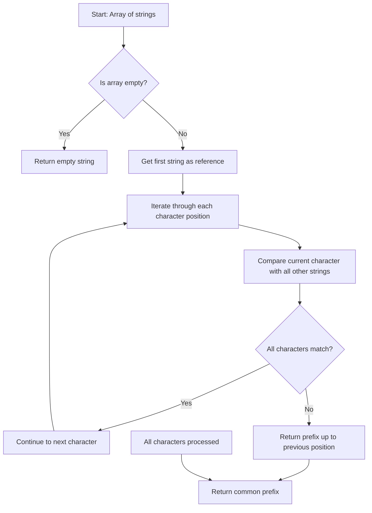
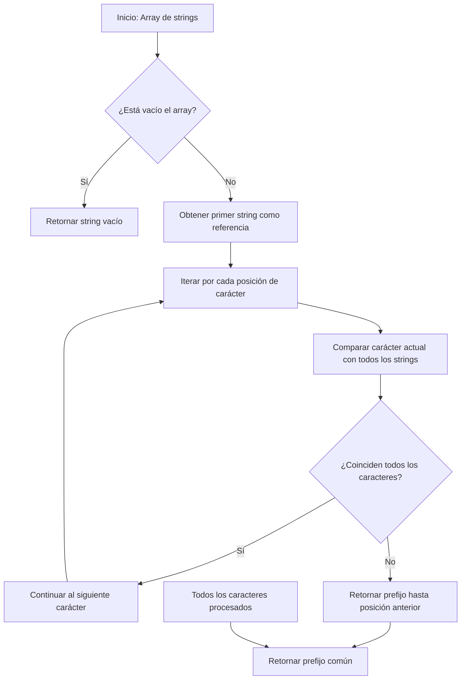

# Longest Common Prefix - LeetCode Problem 14

## Table of Contents

English version:
- [📋 Problem Description](#-problem-description)
- [🧠 Reasoning and Strategy](#-reasoning-and-strategy)
  - [Vertical Scanning Approach](#vertical-scanning-approach)
  - [Horizontal Scanning Approach](#horizontal-scanning-approach)
  - [Sorting and Comparison Approach](#sorting-and-comparison-approach)
- [📊 Flow Diagram](#-flow-diagram)
- [🔍 Detailed Explanation](#-detailed-explanation)
  - [Step-by-Step of Vertical Scanning Algorithm](#step-by-step-of-vertical-scanning-algorithm)
  - [Why Vertical Scanning Works?](#why-vertical-scanning-works)
- [⚡ Computational Complexity](#-computational-complexity)
- [🧪 Important Test Cases](#-important-test-cases)
- [💡 Optimizations and Variants](#-optimizations-and-variants)
  - [Divide and Conquer Approach](#divide-and-conquer-approach)
  - [Trie Data Structure Approach](#trie-data-structure-approach)
- [🚀 Final Implementation](#-final-implementation)
- [✅ Conclusion](#-conclusion)

Spanish version:
- [📋 Descripción del Problema](#-descripción-del-problema)
- [🧠 Razonamiento y Estrategia](#-razonamiento-y-estrategia)
  - [Enfoque de Escaneo Vertical](#enfoque-de-escaneo-vertical)
  - [Enfoque de Escaneo Horizontal](#enfoque-de-escaneo-horizontal)
  - [Enfoque de Ordenamiento y Comparación](#enfoque-de-ordenamiento-y-comparación)
- [📊 Diagrama de Flujo](#-diagrama-de-flujo)
- [🔍 Explicación Detallada](#-explicación-detallada)
  - [Paso a Paso del Algoritmo de Escaneo Vertical](#paso-a-paso-del-algoritmo-de-escaneo-vertical)
  - [¿Por qué funciona el Escaneo Vertical?](#por-qué-funciona-el-escaneo-vertical)
- [⚡ Complejidad Computacional](#-complejidad-computacional)
- [🧪 Casos de Prueba Importantes](#-casos-de-prueba-importantes)
- [💡 Optimizaciones y Variantes](#-optimizaciones-y-variantes)
  - [Enfoque Divide y Vencerás](#enfoque-divide-y-vencerás)
  - [Enfoque con Estructura de Datos Trie](#enfoque-con-estructura-de-datos-trie)
- [🚀 Implementación Final](#-implementación-final)
- [✅ Conclusión](#-conclusión)

---

# ENGLISH VERSION

## 📋 Problem Description
**Link:** https://leetcode.com/problems/longest-common-prefix/

Write a function to find the longest common prefix string amongst an array of strings. If there is no common prefix, return an empty string `""`.

**Example 1:**
```python
Input: strs = ["flower","flow","flight"]
Output: "fl"
```

**Example 2:**
```python
Input: strs = ["dog","racecar","car"]
Output: ""
Explanation: There is no common prefix among the input strings.
```

**Constraints:**
- `1 <= strs.length <= 200`
- `0 <= strs[i].length <= 200`
- `strs[i]` consists of only lowercase English letters.

## 🧠 Reasoning and Strategy

### Vertical Scanning Approach
**Most Efficient Method for Most Cases**
```python
# Complexity: O(n * m)
def longestCommonPrefix(strs):
    if not strs:
        return ""
    
    for i in range(len(strs[0])):
        char = strs[0][i]
        for j in range(1, len(strs)):
            if i >= len(strs[j]) or strs[j][i] != char:
                return strs[0][:i]
    
    return strs[0]
```

**Advantage:** Early termination, optimal for short common prefixes

### Horizontal Scanning Approach
```python
# Complexity: O(n * m)
def longestCommonPrefix(strs):
    if not strs:
        return ""
    
    prefix = strs[0]
    for i in range(1, len(strs)):
        while not strs[i].startswith(prefix):
            prefix = prefix[:-1]
            if not prefix:
                return ""
    return prefix
```

**Advantage:** Simple logic, good for few strings with long prefixes

### Sorting and Comparison Approach
```python
# Complexity: O(n log n + m)
def longestCommonPrefix(strs):
    if not strs:
        return ""
    
    strs.sort()
    first, last = strs[0], strs[-1]
    
    for i in range(min(len(first), len(last))):
        if first[i] != last[i]:
            return first[:i]
    
    return first
```

**Advantage:** Elegant concept, only compares extreme strings

## 📊 Flow Diagram



## 🔍 Detailed Explanation

### Step-by-Step of Vertical Scanning Algorithm

For input `["flower", "flow", "flight"]`:

1. **Check if array is empty** → Continue
2. **Position 0:** Compare 'f' from "flower" with:
   - 'f' from "flow" ✅
   - 'f' from "flight" ✅
3. **Position 1:** Compare 'l' from "flower" with:
   - 'l' from "flow" ✅  
   - 'l' from "flight" ✅
4. **Position 2:** Compare 'o' from "flower" with:
   - 'o' from "flow" ✅
   - 'i' from "flight" ❌ → **MISMATCH**
5. **Return:** `strs[0][:2] = "fl"`

### Why Vertical Scanning Works?
- **Column-wise comparison:** Checks each character position across all strings
- **Early termination:** Stops at the first mismatch encountered
- **Optimal for short prefixes:** Minimizes unnecessary comparisons
- **Handles edge cases:** Naturally handles empty strings and arrays

## ⚡ Computational Complexity

| Approach | Time Complexity | Space Complexity | Best Case | Worst Case |
|----------|----------------|------------------|-----------|------------|
| **Vertical Scanning** | O(n × m) | O(1) | Short prefix | Long prefix |
| **Horizontal Scanning** | O(n × m) | O(1) | Identical strings | Different strings |
| **Sorting Approach** | O(n log n + m) | O(1) | Long prefix | Short prefix |
| **Divide and Conquer** | O(n × m) | O(m log n) | Balanced strings | Unbalanced strings |
| **Trie** | O(n × m) | O(n × m) | Many common prefixes | Few common prefixes |

Where `n` is the number of strings and `m` is the length of the common prefix.

## 🧪 Important Test Cases

```python
# Normal cases
["flower","flow","flight"] → "fl"
["dog","racecar","car"] → ""
["interspecies","interstellar","interstate"] → "inters"

# Edge cases
[] → ""
[""] → ""
["a"] → "a"
["", "a"] → ""
["a", "a"] → "a"
["abc", "ab", "a"] → "a"

# Performance cases
["a"*200] * 200 → "a"*200
["a", "b", "c"] → ""
["leetcode", "leet", "lee", "le"] → "le"
```

## 💡 Optimizations and Variants

### Divide and Conquer Approach
```python
def longestCommonPrefix(strs):
    def common_prefix(left, right):
        min_len = min(len(left), len(right))
        for i in range(min_len):
            if left[i] != right[i]:
                return left[:i]
        return left[:min_len]
    
    def divide(l, r):
        if l == r:
            return strs[l]
        mid = (l + r) // 2
        left_prefix = divide(l, mid)
        right_prefix = divide(mid + 1, r)
        return common_prefix(left_prefix, right_prefix)
    
    if not strs:
        return ""
    return divide(0, len(strs) - 1)
```

### Trie Data Structure Approach
```python
class TrieNode:
    def __init__(self):
        self.children = {}
        self.is_end = False
        self.count = 0

def longestCommonPrefix(strs):
    if not strs:
        return ""
    
    root = TrieNode()
    
    # Build trie
    for word in strs:
        node = root
        for char in word:
            if char not in node.children:
                node.children[char] = TrieNode()
            node = node.children[char]
            node.count += 1
    
    # Find common prefix
    prefix = []
    node = root
    while node.children and len(node.children) == 1:
        char, next_node = next(iter(node.children.items()))
        if next_node.count != len(strs):
            break
        prefix.append(char)
        node = next_node
    
    return "".join(prefix)
```

## 🚀 Final Implementation

```python
class Solution:
    def longestCommonPrefix(self, strs):
        """
        :type strs: List[str]
        :rtype: str
        """
        if not strs:
            return ""
        
        # Vertical scanning - most efficient approach
        for i in range(len(strs[0])):
            char = strs[0][i]
            for j in range(1, len(strs)):
                if i >= len(strs[j]) or strs[j][i] != char:
                    return strs[0][:i]
        
        return strs[0]
```

## ✅ Conclusion

The **Longest Common Prefix problem** is excellent for understanding:
- String manipulation and comparison techniques
- Multiple algorithmic approaches to the same problem
- Time-space complexity tradeoffs
- Early termination strategies

**Key lessons:**
- **Vertical scanning** is optimal for most practical cases
- Different approaches have different strengths depending on input characteristics
- Always consider edge cases and constraints
- The simplest solution is often the most effective

**Recommended approach:** Vertical Scanning for its efficiency, simplicity, and early termination capabilities.

---

# VERSION EN ESPAÑOL

## 📋 Descripción del Problema
**Enlace:** https://leetcode.com/problems/longest-common-prefix/

Escribe una función para encontrar el prefijo común más largo entre un array de strings. Si no hay un prefijo común, retorna un string vacío `""`.

**Ejemplo 1:**
```python
Input: strs = ["flower","flow","flight"]
Output: "fl"
```

**Ejemplo 2:**
```python
Input: strs = ["dog","racecar","car"]
Output: ""
Explicación: No hay prefijo común entre los strings de entrada.
```

**Restricciones:**
- `1 <= strs.length <= 200`
- `0 <= strs[i].length <= 200`
- `strs[i]` consiste solo de letras minúsculas del inglés.

## 🧠 Razonamiento y Estrategia

### Enfoque de Escaneo Vertical
**Método más eficiente para la mayoría de casos**
```python
# Complejidad: O(n * m)
def longestCommonPrefix(strs):
    if not strs:
        return ""
    
    for i in range(len(strs[0])):
        char = strs[0][i]
        for j in range(1, len(strs)):
            if i >= len(strs[j]) or strs[j][i] != char:
                return strs[0][:i]
    
    return strs[0]
```

**Ventaja:** Terminación temprana, óptimo para prefijos comunes cortos

### Enfoque de Escaneo Horizontal
```python
# Complejidad: O(n * m)
def longestCommonPrefix(strs):
    if not strs:
        return ""
    
    prefix = strs[0]
    for i in range(1, len(strs)):
        while not strs[i].startswith(prefix):
            prefix = prefix[:-1]
            if not prefix:
                return ""
    return prefix
```

**Ventaja:** Lógica simple, bueno para pocos strings con prefijos largos

### Enfoque de Ordenamiento y Comparación
```python
# Complejidad: O(n log n + m)
def longestCommonPrefix(strs):
    if not strs:
        return ""
    
    strs.sort()
    first, last = strs[0], strs[-1]
    
    for i in range(min(len(first), len(last))):
        if first[i] != last[i]:
            return first[:i]
    
    return first
```

**Ventaja:** Concepto elegante, solo compara strings extremos

## 📊 Diagrama de Flujo



## 🔍 Explicación Detallada

### Paso a Paso del Algoritmo de Escaneo Vertical

Para entrada `["flower", "flow", "flight"]`:

1. **Verificar si el array está vacío** → Continuar
2. **Posición 0:** Comparar 'f' de "flower" con:
   - 'f' de "flow" ✅
   - 'f' de "flight" ✅
3. **Posición 1:** Comparar 'l' de "flower" con:
   - 'l' de "flow" ✅  
   - 'l' de "flight" ✅
4. **Posición 2:** Comparar 'o' de "flower" con:
   - 'o' de "flow" ✅
   - 'i' de "flight" ❌ → **NO COINCIDENCIA**
5. **Retornar:** `strs[0][:2] = "fl"`

### ¿Por qué funciona el Escaneo Vertical?
- **Comparación por columnas:** Verifica cada posición de carácter en todos los strings
- **Terminación temprana:** Se detiene en la primera no coincidencia encontrada
- **Óptimo para prefijos cortos:** Minimiza comparaciones innecesarias
- **Maneja casos extremos:** Naturalmente maneja strings vacíos y arrays vacíos

## ⚡ Complejidad Computacional

| Enfoque | Complejidad Temporal | Complejidad Espacial | Mejor Caso | Peor Caso |
|---------|---------------------|----------------------|------------|-----------|
| **Escaneo Vertical** | O(n × m) | O(1) | Prefijo corto | Prefijo largo |
| **Escaneo Horizontal** | O(n × m) | O(1) | Strings idénticos | Strings diferentes |
| **Ordenamiento** | O(n log n + m) | O(1) | Prefijo largo | Prefijo corto |
| **Divide y Vencerás** | O(n × m) | O(m log n) | Strings balanceados | Strings no balanceados |
| **Trie** | O(n × m) | O(n × m) | Muchos prefijos comunes | Pocos prefijos comunes |

Donde `n` es el número de strings y `m` es la longitud del prefijo común.

## 🧪 Casos de Prueba Importantes

```python
# Casos normales
["flower","flow","flight"] → "fl"
["dog","racecar","car"] → ""
["interspecies","interstellar","interstate"] → "inters"

# Casos extremos
[] → ""
[""] → ""
["a"] → "a"
["", "a"] → ""
["a", "a"] → "a"
["abc", "ab", "a"] → "a"

# Casos de rendimiento
["a"*200] * 200 → "a"*200
["a", "b", "c"] → ""
["leetcode", "leet", "lee", "le"] → "le"
```

## 💡 Optimizaciones y Variantes

### Enfoque Divide y Vencerás
```python
def longestCommonPrefix(strs):
    def prefijo_comun(izq, der):
        min_len = min(len(izq), len(der))
        for i in range(min_len):
            if izq[i] != der[i]:
                return izq[:i]
        return izq[:min_len]
    
    def divide(l, r):
        if l == r:
            return strs[l]
        mid = (l + r) // 2
        prefijo_izq = divide(l, mid)
        prefijo_der = divide(mid + 1, r)
        return prefijo_comun(prefijo_izq, prefijo_der)
    
    if not strs:
        return ""
    return divide(0, len(strs) - 1)
```

### Enfoque con Estructura de Datos Trie
```python
class NodoTrie:
    def __init__(self):
        self.hijos = {}
        self.es_final = False
        self.contador = 0

def longestCommonPrefix(strs):
    if not strs:
        return ""
    
    raiz = NodoTrie()
    
    # Construir trie
    for palabra in strs:
        nodo = raiz
        for char in palabra:
            if char not in nodo.hijos:
                nodo.hijos[char] = NodoTrie()
            nodo = nodo.hijos[char]
            nodo.contador += 1
    
    # Encontrar prefijo común
    prefix = []
    nodo = raiz
    while nodo.hijos and len(nodo.hijos) == 1:
        char, siguiente_nodo = next(iter(nodo.hijos.items()))
        if siguiente_nodo.contador != len(strs):
            break
        prefix.append(char)
        nodo = siguiente_nodo
    
    return "".join(prefix)
```

## 🚀 Implementación Final

```python
class Solution:
    def longestCommonPrefix(self, strs):
        """
        :type strs: List[str]
        :rtype: str
        """
        if not strs:
            return ""
        
        # Escaneo vertical - enfoque más eficiente
        for i in range(len(strs[0])):
            char = strs[0][i]
            for j in range(1, len(strs)):
                if i >= len(strs[j]) or strs[j][i] != char:
                    return strs[0][:i]
        
        return strs[0]
```

## ✅ Conclusión

El **problema de Longest Common Prefix** es excelente para entender:
- Técnicas de manipulación y comparación de strings
- Múltiples enfoques algorítmicos para el mismo problema
- Compromisos entre complejidad temporal y espacial
- Estrategias de terminación temprana

**Lecciones clave:**
- **El escaneo vertical** es óptimo para la mayoría de casos prácticos
- Diferentes enfoques tienen diferentes fortalezas según las características de entrada
- Siempre considerar casos extremos y restricciones
- La solución más simple es frecuentemente la más efectiva

**Enfoque recomendado:** Escaneo Vertical por su eficiencia, simplicidad y capacidades de terminación temprana.