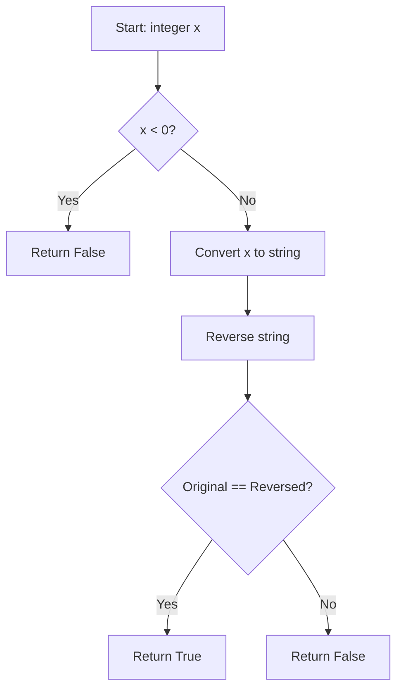
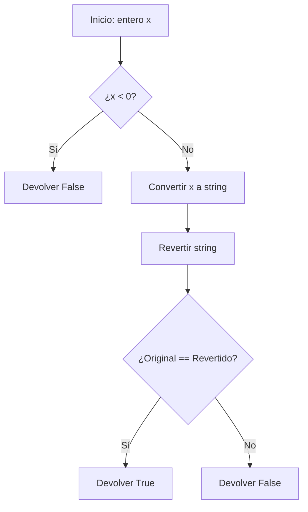

# Palindrome Number - LeetCode Problem 9

## Table of Contents

English version:
- [📋 Problem Description](#-problem-description)
- [🧠 Reasoning and Strategy](#-reasoning-and-strategy)
  - [String Conversion Approach](#string-conversion-approach)
  - [Mathematical Approach](#mathematical-approach)
- [📊 Flow Diagram](#-flow-diagram)
- [🔍 Detailed Explanation](#-detailed-explanation)
  - [Step-by-Step of String Conversion](#step-by-step-of-string-conversion)
  - [Step-by-Step of Mathematical Approach](#step-by-step-of-mathematical-approach)
- [⚡ Computational Complexity](#-computational-complexity)
- [🧪 Important Test Cases](#-important-test-cases)
- [💡 Optimizations and Variants](#-optimizations-and-variants)
  - [Half Reversal Optimization](#half-reversal-optimization)
- [🚀 Final Implementation](#-final-implementation)
- [✅ Conclusion](#-conclusion)

Spanish version:
- [📋 Descripción del Problema](#-descripción-del-problema)
- [🧠 Razonamiento y Estrategia](#-razonamiento-y-estrategia)
  - [Enfoque con Conversión a String](#enfoque-con-conversión-a-string)
  - [Enfoque Matemático](#enfoque-matemático)
- [📊 Diagrama de Flujo](#-diagrama-de-flujo)
- [🔍 Explicación Detallada](#-explicación-detallada)
  - [Paso a Paso con Conversión a String](#paso-a-paso-con-conversión-a-string)
  - [Paso a Paso del Enfoque Matemático](#paso-a-paso-del-enfoque-matemático)
- [⚡ Complejidad Computacional](#-complejidad-computacional)
- [🧪 Casos de Prueba Importantes](#-casos-de-prueba-importantes)
- [💡 Optimizaciones y Variantes](#-optimizaciones-y-variantes)
  - [Optimización de Reversión Parcial](#optimización-de-reversión-parcial)
- [🚀 Implementación Final](#-implementación-final)
- [✅ Conclusión](#-conclusión)

---

# ENGLISH VERSION

## 📋 Problem Description
**Link:** https://leetcode.com/problems/palindrome-number/

Given an integer `x`, return `true` if `x` is a palindrome, and `false` otherwise.

**Constraints:**
- -2³¹ <= x <= 2³¹ - 1

**Example:**
```python
Input: x = 121
Output: true
Explanation: 121 reads as 121 from left to right and from right to left.
```

## 🧠 Reasoning and Strategy

### String Conversion Approach
```python
# Complexity: O(n)
def isPalindrome(x):
    if x < 0:
        return False
    return str(x) == str(x)[::-1]
```

**Advantages:** Simple, readable, and efficient enough for most cases

### Mathematical Approach
```python
# Complexity: O(log₁₀(n))
def isPalindrome(x):
    if x < 0 or (x % 10 == 0 and x != 0):
        return False
        
    reversed_num = 0
    original = x
    
    while x > 0:
        reversed_num = reversed_num * 10 + x % 10
        x //= 10
        
    return original == reversed_num
```

**Advantages:** No string conversion, constant space

## 📊 Flow Diagram



## 🔍 Detailed Explanation

### Step-by-Step of String Conversion

**Example: x = 121**
1. Check if negative → No
2. Convert to string → "121"
3. Reverse string → "121"
4. Compare → "121" == "121" → True

**Example: x = -121**
1. Check if negative → Yes → Return False

### Step-by-Step of Mathematical Approach

**Example: x = 121**
1. Check if negative → No
2. Initialize reversed_num = 0
3. Iteration 1: reversed_num = 0*10 + 1 = 1, x = 12
4. Iteration 2: reversed_num = 1*10 + 2 = 12, x = 1
5. Iteration 3: reversed_num = 12*10 + 1 = 121, x = 0
6. Compare: 121 == 121 → True

## ⚡ Computational Complexity

| Method | Time | Space | Advantages | Disadvantages |
|--------|------|-------|------------|---------------|
| String Conversion | O(n) | O(n) | Simple, readable | Extra memory |
| Mathematical | O(log₁₀(n)) | O(1) | No extra memory | More complex |

## 🧪 Important Test Cases

```python
# Case 1: Positive palindrome
x = 121 → True

# Case 2: Negative number
x = -121 → False

# Case 3: Single digit
x = 5 → True

# Case 4: Even length palindrome
x = 1221 → True

# Case 5: Non-palindrome
x = 123 → False

# Case 6: Ends with zero (not zero itself)
x = 10 → False
```

## 💡 Optimizations and Variants

### Half Reversal Optimization
Reverse only half of the number to avoid potential overflow:

```python
def isPalindrome(x):
    if x < 0 or (x % 10 == 0 and x != 0):
        return False
        
    reversed_half = 0
    while x > reversed_half:
        reversed_half = reversed_half * 10 + x % 10
        x //= 10
        
    return x == reversed_half or x == reversed_half // 10
```

## 🚀 Final Implementation

```python
class Solution:
    def isPalindrome(self, x: int) -> bool:
        # String conversion approach (most readable)
        if x < 0:
            return False
        return str(x) == str(x)[::-1]
```

## ✅ Conclusion

The **palindrome number problem** teaches important concepts:
- String manipulation and comparison
- Mathematical number reversal
- Edge case handling (negatives, zeros)

**Key lessons:**
- Sometimes the most readable solution is the best choice
- Consider trade-offs between simplicity and efficiency
- Always test edge cases thoroughly

---

# VERSION EN ESPAÑOL

## 📋 Descripción del Problema
**Enlace:** https://leetcode.com/problems/palindrome-number/

Dado un entero `x`, devuelve `true` si `x` es un palíndromo, y `false` en caso contrario.

**Restricciones:**
- -2³¹ <= x <= 2³¹ - 1

**Ejemplo:**
```python
Input: x = 121
Output: true
Explicación: 121 se lee igual de izquierda a derecha que de derecha a izquierda.
```

## 🧠 Razonamiento y Estrategia

### Enfoque con Conversión a String
```python
# Complejidad: O(n)
def isPalindrome(x):
    if x < 0:
        return False
    return str(x) == str(x)[::-1]
```

**Ventajas:** Simple, legible y suficientemente eficiente

### Enfoque Matemático
```python
# Complejidad: O(log₁₀(n))
def isPalindrome(x):
    if x < 0 or (x % 10 == 0 and x != 0):
        return False
        
    reversed_num = 0
    original = x
    
    while x > 0:
        reversed_num = reversed_num * 10 + x % 10
        x //= 10
        
    return original == reversed_num
```

**Ventajas:** Sin conversión a string, espacio constante

## 📊 Diagrama de Flujo



## 🔍 Explicación Detallada

### Paso a Paso con Conversión a String

**Ejemplo: x = 121**
1. Verificar si es negativo → No
2. Convertir a string → "121"
3. Revertir string → "121"
4. Comparar → "121" == "121" → True

**Ejemplo: x = -121**
1. Verificar si es negativo → Sí → Devolver False

### Paso a Paso del Enfoque Matemático

**Ejemplo: x = 121**
1. Verificar si es negativo → No
2. Inicializar reversed_num = 0
3. Iteración 1: reversed_num = 0*10 + 1 = 1, x = 12
4. Iteración 2: reversed_num = 1*10 + 2 = 12, x = 1
5. Iteración 3: reversed_num = 12*10 + 1 = 121, x = 0
6. Comparar: 121 == 121 → True

## ⚡ Complejidad Computacional

| Método | Tiempo | Espacio | Ventajas | Desventajas |
|--------|--------|---------|----------|-------------|
| Conversión a String | O(n) | O(n) | Simple, legible | Memoria extra |
| Matemático | O(log₁₀(n)) | O(1) | Sin memoria extra | Más complejo |

## 🧪 Casos de Prueba Importantes

```python
# Caso 1: Palíndromo positivo
x = 121 → True

# Caso 2: Número negativo
x = -121 → False

# Caso 3: Dígito único
x = 5 → True

# Caso 4: Palíndromo de longitud par
x = 1221 → True

# Caso 5: No palíndromo
x = 123 → False

# Caso 6: Termina en cero (no cero mismo)
x = 10 → False
```

## 💡 Optimizaciones y Variantes

### Optimización de Reversión Parcial
Revertir solo la mitad del número para evitar overflow:

```python
def isPalindrome(x):
    if x < 0 or (x % 10 == 0 and x != 0):
        return False
        
    reversed_half = 0
    while x > reversed_half:
        reversed_half = reversed_half * 10 + x % 10
        x //= 10
        
    return x == reversed_half or x == reversed_half // 10
```

## 🚀 Implementación Final

```python
class Solution:
    def isPalindrome(self, x: int) -> bool:
        # Enfoque con conversión a string (más legible)
        if x < 0:
            return False
        return str(x) == str(x)[::-1]
```

## ✅ Conclusión

El **problema del número palíndromo** enseña conceptos importantes:
- Manipulación y comparación de strings
- Reversión matemática de números
- Manejo de casos edge (negativos, ceros)

**Lecciones clave:**
- A veces la solución más legible es la mejor opción
- Considerar trade-offs entre simplicidad y eficiencia
- Siempre probar casos edge exhaustivamente

---