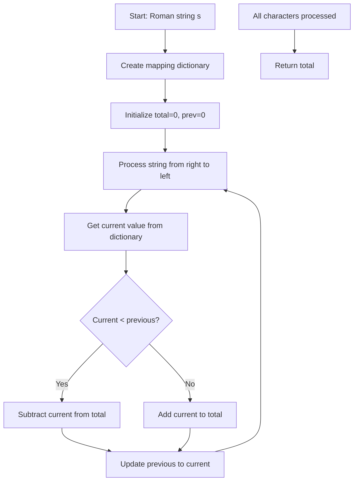
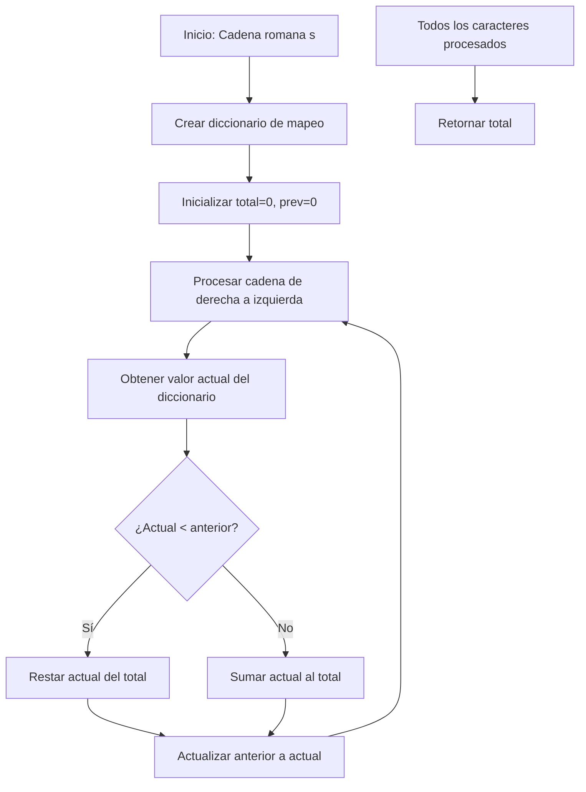

# Roman to Integer - LeetCode Problem 13

## Table of Contents

English version:
- [📋 Problem Description](#-problem-description)
- [🧠 Reasoning and Strategy](#-reasoning-and-strategy)
  - [Right-to-Left Processing Approach](#right-to-left-processing-approach)
  - [Left-to-Right with Lookahead Approach](#left-to-right-with-lookahead-approach)
- [📊 Flow Diagram](#-flow-diagram)
- [🔍 Detailed Explanation](#-detailed-explanation)
  - [Step-by-Step of Right-to-Left Algorithm](#step-by-step-of-right-to-left-algorithm)
  - [Why It Works?](#why-it-works)
- [⚡ Computational Complexity](#-computational-complexity)
- [🧪 Important Test Cases](#-important-test-cases)
- [💡 Optimizations and Variants](#-optimizations-and-variants)
  - [Using reversed() Iterator](#using-reversed-iterator)
  - [Mathematical Approach Without Hash Table](#mathematical-approach-without-hash-table)
- [🚀 Final Implementation](#-final-implementation)
- [✅ Conclusion](#-conclusion)

Spanish version:
- [📋 Descripción del Problema](#-descripción-del-problema)
- [🧠 Razonamiento y Estrategia](#-razonamiento-y-estrategia)
  - [Enfoque de Procesamiento de Derecha a Izquierda](#enfoque-de-procesamiento-de-derecha-a-izquierda)
  - [Enfoque de Izquierda a Derecha con Lookahead](#enfoque-de-izquierda-a-derecha-con-lookahead)
- [📊 Diagrama de Flujo](#-diagrama-de-flujo)
- [🔍 Explicación Detallada](#-explicación-detallada)
  - [Paso a Paso del Algoritmo de Derecha a Izquierda](#paso-a-paso-del-algoritmo-de-derecha-a-izquierda)
  - [¿Por qué funciona?](#por-qué-funciona)
- [⚡ Complejidad Computacional](#-complejidad-computacional)
- [🧪 Casos de Prueba Importantes](#-casos-de-prueba-importantes)
- [💡 Optimizaciones y Variantes](#-optimizaciones-y-variantes)
  - [Usando Iterador reversed()](#usando-iterador-reversed)
  - [Enfoque Matemático Sin Tabla Hash](#enfoque-matemático-sin-tabla-hash)
- [🚀 Implementación Final](#-implementación-final)
- [✅ Conclusión](#-conclusión)

## 📋 Problem Description
**Link:** https://leetcode.com/problems/roman-to-integer/

Roman numerals are represented by seven different symbols: I, V, X, L, C, D and M.

```
Symbol       Value
I             1
V             5
X             10
L             50
C             100
D             500
M             1000
```

Roman numerals are usually written largest to smallest from left to right. However, there are six instances where subtraction is used:

- I can be placed before V (5) and X (10) to make 4 and 9. 
- X can be placed before L (50) and C (100) to make 40 and 90. 
- C can be placed before D (500) and M (1000) to make 400 and 900.

Given a roman numeral, convert it to an integer.

**Example:**
```python
Input: s = "MCMXCIV"
Output: 1994
Explanation: M = 1000, CM = 900, XC = 90, IV = 4.
```

## 🧠 Reasoning and Strategy

### Right-to-Left Processing Approach
```python
# Complexity: O(n)
def romanToInt(s):
    roman = {'I': 1, 'V': 5, 'X': 10, 'L': 50, 'C': 100, 'D': 500, 'M': 1000}
    total = 0
    prev = 0
    
    for char in reversed(s):
        current = roman[char]
        if current < prev:
            total -= current
        else:
            total += current
        prev = current
    
    return total
```

**Advantage:** Elegantly handles subtractive notation without special cases

### Left-to-Right with Lookahead Approach
```python
# Complexity: O(n)
def romanToInt(s):
    roman = {'I': 1, 'V': 5, 'X': 10, 'L': 50, 'C': 100, 'D': 500, 'M': 1000}
    total = 0
    i = 0
    
    while i < len(s):
        # Check if subtractive notation
        if i + 1 < len(s) and roman[s[i]] < roman[s[i + 1]]:
            total += roman[s[i + 1]] - roman[s[i]]
            i += 2
        else:
            total += roman[s[i]]
            i += 1
    
    return total
```

## 📊 Flow Diagram



## 🔍 Detailed Explanation

### Step-by-Step of Right-to-Left Algorithm

For input "MCMXCIV" (1994):

**Processing from right to left:**
- V: 5 (add) → total = 5, prev = 5
- I: 1 (1 < 5 → subtract) → total = 4, prev = 1
- C: 100 (100 > 1 → add) → total = 104, prev = 100
- X: 10 (10 < 100 → subtract) → total = 94, prev = 10
- M: 1000 (1000 > 10 → add) → total = 1094, prev = 1000
- C: 100 (100 < 1000 → subtract) → total = 994, prev = 100
- M: 1000 (1000 > 100 → add) → total = 1994, prev = 1000

### Why It Works?
- **Subtractive notation detection:** When a smaller value appears before a larger value, it indicates subtraction
- **Right-to-left processing:** Simplifies logic by comparing each value with the previously processed value
- **No special cases needed:** The algorithm naturally handles all subtractive cases

## ⚡ Computational Complexity

| Method | Time | Space | Advantages | Disadvantages |
|--------|------|-------|------------|---------------|
| Right-to-Left | O(n) | O(1) | Elegant, simple | Creates reversed copy (O(n) space) |
| Left-to-Right | O(n) | O(1) | No extra space | Requires lookahead logic |
| reversed() iterator | O(n) | O(1) | Optimal space | Slightly less readable |

## 🧪 Important Test Cases

```python
# Case 1: Normal subtractive cases
s = "IV" → 4
s = "IX" → 9
s = "XL" → 40
s = "XC" → 90
s = "CD" → 400
s = "CM" → 900

# Case 2: Complex number
s = "MCMXCIV" → 1994

# Case 3: No subtractive notation
s = "III" → 3
s = "LVIII" → 58

# Case 4: Maximum value
s = "MMMCMXCIX" → 3999
```

## 💡 Optimizations and Variants

### Using reversed() Iterator
```python
def romanToInt(s):
    roman = {'I': 1, 'V': 5, 'X': 10, 'L': 50, 'C': 100, 'D': 500, 'M': 1000}
    total = 0
    prev = 0
    
    for char in reversed(s):  # O(1) space iterator
        current = roman[char]
        if current < prev:
            total -= current
        else:
            total += current
        prev = current
    
    return total
```

### Mathematical Approach Without Hash Table
```python
def romanToInt(s):
    def value(c):
        if c == 'I': return 1
        if c == 'V': return 5
        if c == 'X': return 10
        if c == 'L': return 50
        if c == 'C': return 100
        if c == 'D': return 500
        if c == 'M': return 1000
        return 0
    
    total = 0
    prev = 0
    
    for char in reversed(s):
        current = value(char)
        if current < prev:
            total -= current
        else:
            total += current
        prev = current
    
    return total
```

## 🚀 Final Implementation

```python
class Solution:
    def romanToInt(self, s: str) -> int:
        roman = {'I': 1, 'V': 5, 'X': 10, 'L': 50, 'C': 100, 'D': 500, 'M': 1000}
        total = 0
        prev = 0
        
        for char in reversed(s):
            current = roman[char]
            if current < prev:
                total -= current
            else:
                total += current
            prev = current
        
        return total
```

## ✅ Conclusion

The **Roman to Integer problem** is excellent for understanding:
- String processing techniques
- Right-to-left vs left-to-right approaches
- Handling special cases through algorithmic design

**Key lessons:**
- Right-to-left processing can simplify complex pattern recognition
- Hash tables provide efficient value lookups
- Sometimes the most elegant solution processes data in reverse order
- Roman numeral rules follow consistent patterns that can be algorithmically captured

---

## 📋 Descripción del Problema
**Enlace:** https://leetcode.com/problems/roman-to-integer/

Los números romanos se representan con siete símbolos diferentes: I, V, X, L, C, D y M.

```
Símbolo       Valor
I             1
V             5
X             10
L             50
C             100
D             500
M             1000
```

Los números romanos generalmente se escriben de mayor a menor de izquierda a derecha. Sin embargo, hay seis instancias donde se usa sustracción:

- I puede colocarse antes de V (5) y X (10) para hacer 4 y 9.
- X puede colocarse antes de L (50) y C (100) para hacer 40 y 90.
- C puede colocarse antes de D (500) y M (1000) para hacer 400 y 900.

Dado un numeral romano, conviértelo a un entero.

**Ejemplo:**
```python
Input: s = "MCMXCIV"
Output: 1994
Explicación: M = 1000, CM = 900, XC = 90, IV = 4.
```

## 🧠 Razonamiento y Estrategia

### Enfoque de Procesamiento de Derecha a Izquierda
```python
# Complejidad: O(n)
def romanToInt(s):
    roman = {'I': 1, 'V': 5, 'X': 10, 'L': 50, 'C': 100, 'D': 500, 'M': 1000}
    total = 0
    prev = 0
    
    for char in reversed(s):
        current = roman[char]
        if current < prev:
            total -= current
        else:
            total += current
        prev = current
    
    return total
```

**Ventaja:** Maneja elegantemente la notación sustractiva sin casos especiales

### Enfoque de Izquierda a Derecha con Lookahead
```python
# Complejidad: O(n)
def romanToInt(s):
    roman = {'I': 1, 'V': 5, 'X': 10, 'L': 50, 'C': 100, 'D': 500, 'M': 1000}
    total = 0
    i = 0
    
    while i < len(s):
        # Verificar notación sustractiva
        if i + 1 < len(s) and roman[s[i]] < roman[s[i + 1]]:
            total += roman[s[i + 1]] - roman[s[i]]
            i += 2
        else:
            total += roman[s[i]]
            i += 1
    
    return total
```

## 📊 Diagrama de Flujo



## 🔍 Explicación Detallada

### Paso a Paso del Algoritmo de Derecha a Izquierda

Para entrada "MCMXCIV" (1994):

**Procesando de derecha a izquierda:**
- V: 5 (sumar) → total = 5, prev = 5
- I: 1 (1 < 5 → restar) → total = 4, prev = 1
- C: 100 (100 > 1 → sumar) → total = 104, prev = 100
- X: 10 (10 < 100 → restar) → total = 94, prev = 10
- M: 1000 (1000 > 10 → sumar) → total = 1094, prev = 1000
- C: 100 (100 < 1000 → restar) → total = 994, prev = 100
- M: 1000 (1000 > 100 → sumar) → total = 1994, prev = 1000

### ¿Por qué funciona?
- **Detección de notación sustractiva:** Cuando un valor menor aparece antes de uno mayor, indica resta
- **Procesamiento de derecha a izquierda:** Simplifica la lógica comparando cada valor con el valor previamente procesado
- **No se necesitan casos especiales:** El algoritmo maneja naturalmente todos los casos sustractivos

## ⚡ Complejidad Computacional

| Método | Tiempo | Espacio | Ventajas | Desventajas |
|--------|--------|---------|----------|-------------|
| Derecha-a-Izquierda | O(n) | O(1) | Elegante, simple | Crea copia invertida (O(n) espacio) |
| Izquierda-a-Derecha | O(n) | O(1) | Sin espacio extra | Requiere lógica de lookahead |
| Iterador reversed() | O(n) | O(1) | Espacio óptimo | Un poco menos legible |

## 🧪 Casos de Prueba Importantes

```python
# Caso 1: Casos sustractivos normales
s = "IV" → 4
s = "IX" → 9
s = "XL" → 40
s = "XC" → 90
s = "CD" → 400
s = "CM" → 900

# Caso 2: Número complejo
s = "MCMXCIV" → 1994

# Caso 3: Sin notación sustractiva
s = "III" → 3
s = "LVIII" → 58

# Caso 4: Valor máximo
s = "MMMCMXCIX" → 3999
```

## 💡 Optimizaciones y Variantes

### Usando Iterador reversed()
```python
def romanToInt(s):
    roman = {'I': 1, 'V': 5, 'X': 10, 'L': 50, 'C': 100, 'D': 500, 'M': 1000}
    total = 0
    prev = 0
    
    for char in reversed(s):  # Iterador O(1) en espacio
        current = roman[char]
        if current < prev:
            total -= current
        else:
            total += current
        prev = current
    
    return total
```

### Enfoque Matemático Sin Tabla Hash
```python
def romanToInt(s):
    def valor(c):
        if c == 'I': return 1
        if c == 'V': return 5
        if c == 'X': return 10
        if c == 'L': return 50
        if c == 'C': return 100
        if c == 'D': return 500
        if c == 'M': return 1000
        return 0
    
    total = 0
    prev = 0
    
    for char in reversed(s):
        actual = valor(char)
        if actual < prev:
            total -= actual
        else:
            total += actual
        prev = actual
    
    return total
```

## 🚀 Implementación Final

```python
class Solution:
    def romanToInt(self, s: str) -> int:
        roman = {'I': 1, 'V': 5, 'X': 10, 'L': 50, 'C': 100, 'D': 500, 'M': 1000}
        total = 0
        prev = 0
        
        for char in reversed(s):
            current = roman[char]
            if current < prev:
                total -= current
            else:
                total += current
            prev = current
        
        return total
```

## ✅ Conclusión

El **problema de Roman to Integer** es excelente para entender:
- Técnicas de procesamiento de cadenas
- Enfoques de derecha a izquierda vs izquierda a derecha
- Manejo de casos especiales mediante diseño algorítmico

**Lecciones clave:**
- El procesamiento de derecha a izquierda puede simplificar el reconocimiento de patrones complejos
- Las tablas hash proporcionan búsquedas de valores eficientes
- A veces la solución más elegante procesa los datos en orden inverso
- Las reglas de los números romanos siguen patrones consistentes que pueden capturarse algorítmicamente

---